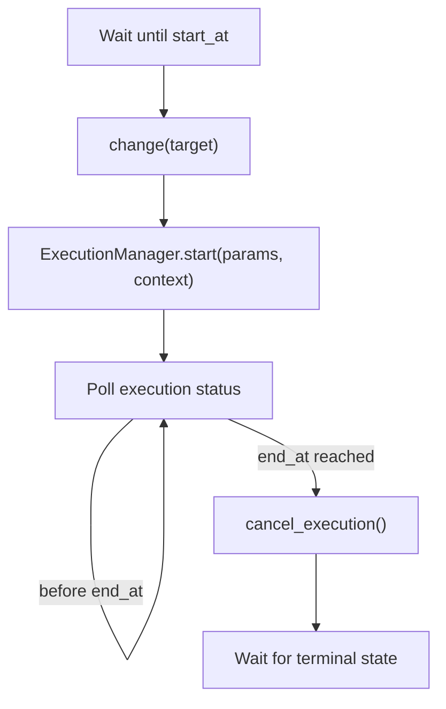

# ガス捕集と時間駆動シーケンスの設計メモ

このメモは、ガスバッグに一定時間ガスを捕集するような「装置状態を一定時間維持する」操作を、stationkit の既存 API でどう表現するかを整理する。

## 結論

現行の stationkit では、ガス捕集は `execute` の中に「捕集中」という長時間操作として実装するのが最も自然で安全である。

`TIME_DRIVEN` は「`start_at` まで待ち、`change(target)` 後に `execute` を開始し、`end_at` に到達したら `cancel_execution()` を要求する」モードである。

加えて、controller が `_do_execute(..., *, context: ExecutionContext)` を opt-in している場合、
Sequence の予定境界は `context.scheduled_start_at` / `context.scheduled_end_at` として渡される。
したがって、測定時間を `execute_params` に重複して書く必要はない。

一方、context 非対応の controller では従来どおり `execute_params.duration_s` を使う。

## 推奨実装（ExecutionContext 利用）

`TIME_DRIVEN` の `end_at` を deadline として使い、到達前に cancel されても安全に閉じる。

```python
import asyncio
from datetime import datetime, timezone
from typing import Any

from stationkit import ExecutionCancelledError, ExecutionContext, StationControllerBase


class GasBagController(StationControllerBase):
    def __init__(self) -> None:
        super().__init__()
        self._gas_bag: int | None = None
        self._cancel_requested = False

    async def _do_change(self, target: int) -> None:
        self._gas_bag = target

    def cancel_execution(self) -> None:
        self._cancel_requested = True

    async def _do_execute(self, *, context: ExecutionContext) -> dict[str, Any]:
        if self._gas_bag is None:
            raise RuntimeError("gas bag is not selected")

        self._cancel_requested = False
        opened = False
        try:
            await self._open_gas_bag_valve(self._gas_bag)
            opened = True

            # TIME_DRIVEN: scheduled_end_at まで保持（runner が end_at で cancel も要求する）
            # COMPLETION_DRIVEN / 直接実行: scheduled_end_at は None。必要なら別途 params を使う。
            deadline = context.scheduled_end_at
            while deadline is None or datetime.now(timezone.utc) < deadline:
                if self._cancel_requested:
                    raise ExecutionCancelledError("Gas collection cancelled.")
                await asyncio.sleep(0.2)
                if deadline is None:
                    # 完了駆動で deadline が無い場合は即座に終えるか、params 併用へ。
                    break

            return {
                "gas_bag": self._gas_bag,
                "started_at": context.started_at.isoformat(),
                "scheduled_end_at": None
                if deadline is None
                else deadline.isoformat(),
            }
        finally:
            if opened:
                await self._close_gas_bag_valve(self._gas_bag)
```

ポイントは次の通り。

- `change(target)` は「どのガスバッグを対象にするか」を選ぶ。
- `_do_execute(..., context=...)` は「バルブを開けて、予定終了または cancel まで捕集し、必ず閉じる」一連の操作を表す。
- `context.scheduled_*` は **予定時刻**。`context.started_at` は **実開始時刻**。遅延開始があっても予定開始は書き換えられない。
- `finally` でバルブを閉じることで、成功・失敗・cancel のどれでも安全側へ戻す。
- `cancel_execution()` は同期メソッドとして実装し、`_do_execute()` 側が短い間隔でフラグを確認して `ExecutionCancelledError` を送出する。

この形なら `TIME_DRIVEN` では Sequence 行の `end_at` をそのまま deadline にでき、
`execute_params` に測定時間を二重入力する必要がない。

## 互換実装（execute_params.duration_s）

context を使わない既存 controller では、これまでどおり `duration_s` を params に渡す。

```python
from pydantic import BaseModel, Field


class GasCollectionParams(BaseModel):
    duration_s: float = Field(gt=0)


class LegacyGasBagController(StationControllerBase):
    async def _do_execute(self, params: GasCollectionParams) -> dict[str, Any]:
        remaining_s = params.duration_s
        while remaining_s > 0:
            if self._cancel_requested:
                raise ExecutionCancelledError("Gas collection cancelled.")
            interval_s = min(0.2, remaining_s)
            await asyncio.sleep(interval_s)
            remaining_s -= interval_s
        return {"duration_s": params.duration_s}
```

## `TIME_DRIVEN` を使う場合の注意

`TIME_DRIVEN` の `start_at` / `end_at` は、runner が扱うスケジュール境界である。
context 対応 controller では同じ値が `scheduled_start_at` / `scheduled_end_at` としても渡る。

処理の流れは概ね次のようになる。



そのため、以下の実装は避ける。

```python
async def _do_execute(self) -> None:
    await self._open_gas_bag_valve(self._gas_bag)
    await self._close_gas_bag_valve(self._gas_bag)
```

この実装は一瞬で `SUCCEEDED` になるため、`end_at` による停止制御が働かない。時間駆動の行に `start_at` / `end_at` を設定していても、バルブを開いたまま保持する意味にはならない。

また、`TIME_DRIVEN` は終了時刻で `cancel_execution()` を使うため、controller が cancel に対応していない場合は validation で拒否される。対応している場合でも、装置が実際に安全停止できること、また cancel 後に `_do_execute()` が速やかに終端状態へ到達することが前提になる。

## 設計上の判断基準

- **時間駆動で予定終了まで保持したい**: `ExecutionContext.scheduled_end_at` を使う（推奨）。
- **完了駆動で相対時間だけ決めたい**: `execute_params.duration_s` を使う。
- **両方をサポートしたい**: `_do_execute(self, params: Params | None = None, *, context: ExecutionContext)` とし、`scheduled_end_at` があればそれを優先する。

一方で、次のような要求が多い場合は、フレームワーク側の語彙を増やす余地がある。

- `execute` せず、単に現在状態を N 秒保持したい。
- 絶対時刻ではなく「前ステップ完了から N 秒待つ」を行として書きたい。
- 「開く」「待つ」「閉じる」を UI 上の別ステップとして明示したい。
- `change + execute` 固定ではなく、`change` のみ、`wait` のみ、`custom_action` のみの行を扱いたい。

この場合の改善案は、段階的には次の順で検討する。

1. `ExecutionContext` または `execute_params.duration_s` で長時間 `execute` として実装する。
2. シーケンス定義に相対時間の `hold_seconds` または `duration_s` を追加し、runner が `start_at` / `end_at` を補完できるようにする。
3. シーケンス行に `kind` を導入し、`change_execute`、`wait`、`action` などを明示できるようにする。

3 は UI、HTTP schema、validation、runner の変更範囲が大きい。現時点では、まず 1 の形でガス捕集 controller を実装し、複数の実装例で同じ不自然さが繰り返し出る場合に 2 または 3 を検討するのがよい。
