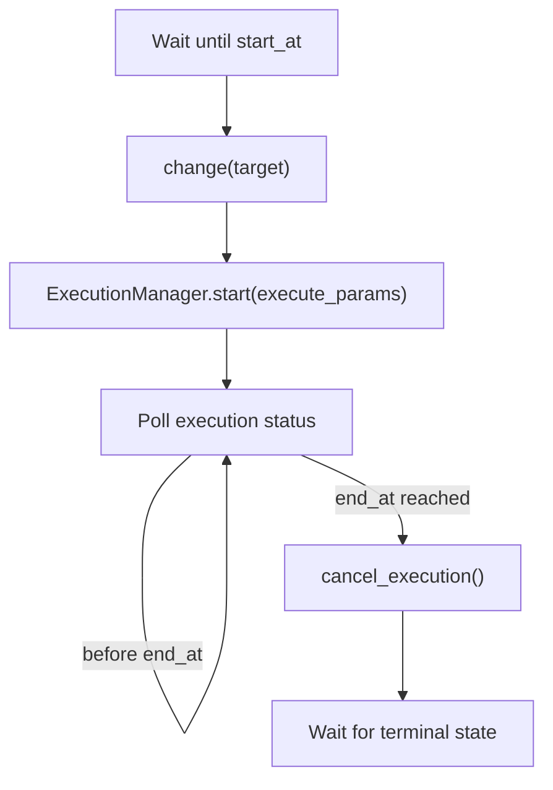

# ガス捕集と時間駆動シーケンスの設計メモ

このメモは、ガスバッグに一定時間ガスを捕集するような「装置状態を一定時間維持する」操作を、stationkit の既存 API でどう表現するかを整理する。

## 結論

現行の stationkit では、ガス捕集は `execute` の中に「捕集中」という長時間操作として実装するのが最も自然で安全である。

`TIME_DRIVEN` は「`start_at` まで待ち、`change(target)` 後に `execute` を開始し、`end_at` に到達したら `cancel_execution()` を要求する」モードであり、`_do_execute()` に duration や deadline を自動注入する仕組みではない。したがって、`_do_execute()` がバルブを開閉するだけですぐ戻る実装だと、シーケンス runner はそのステップを完了扱いにし、`end_at` まで状態を保持しない。

## 現行 API での推奨実装

ガス捕集を 1 回の長時間 `execute` と見なし、`execute_params` に捕集時間を渡す。

```python
import asyncio
from typing import Any

from pydantic import BaseModel, Field

from stationkit import ExecutionCancelledError, StationControllerBase


class GasCollectionParams(BaseModel):
    duration_s: float = Field(gt=0)


class GasBagController(StationControllerBase):
    def __init__(self) -> None:
        super().__init__()
        self._gas_bag: int | None = None
        self._cancel_requested = False

    async def _do_change(self, target: int) -> None:
        self._gas_bag = target

    def cancel_execution(self) -> None:
        self._cancel_requested = True

    async def _do_execute(self, params: GasCollectionParams) -> dict[str, Any]:
        if self._gas_bag is None:
            raise RuntimeError("gas bag is not selected")

        self._cancel_requested = False
        opened = False
        try:
            await self._open_gas_bag_valve(self._gas_bag)
            opened = True

            remaining_s = params.duration_s
            while remaining_s > 0:
                if self._cancel_requested:
                    raise ExecutionCancelledError("Gas collection cancelled.")
                interval_s = min(0.2, remaining_s)
                await asyncio.sleep(interval_s)
                remaining_s -= interval_s

            return {"gas_bag": self._gas_bag, "duration_s": params.duration_s}
        finally:
            if opened:
                await self._close_gas_bag_valve(self._gas_bag)
```

ポイントは次の通り。

- `change(target)` は「どのガスバッグを対象にするか」を選ぶ。
- `_do_execute(params)` は「バルブを開けて、指定時間または cancel まで捕集し、必ず閉じる」一連の操作を表す。
- `finally` でバルブを閉じることで、成功・失敗・cancel のどれでも安全側へ戻す。
- `cancel_execution()` は同期メソッドとして実装し、`_do_execute()` 側が短い間隔でフラグを確認して `ExecutionCancelledError` を送出する。

この形なら `COMPLETION_DRIVEN` では `duration_s` が終わるまで次ステップに進まず、`TIME_DRIVEN` では `end_at` 到達時の cancel 要求で捕集を終了できる。

## `TIME_DRIVEN` を使う場合の注意

`TIME_DRIVEN` の `start_at` / `end_at` は、操作に渡される「待機時間」ではなく、runner が扱うスケジュール境界である。

処理の流れは概ね次のようになる。



そのため、以下の実装は避ける。

```python
async def _do_execute(self) -> None:
    await self._open_gas_bag_valve(self._gas_bag)
    await self._close_gas_bag_valve(self._gas_bag)
```

この実装は一瞬で `SUCCEEDED` になるため、`end_at` による停止制御が働かない。時間駆動の行に `start_at` / `end_at` を設定していても、バルブを開いたまま保持する意味にはならない。

また、`TIME_DRIVEN` は終了時刻で `cancel_execution()` を使うため、controller が cancel に対応していない場合は validation で拒否される。対応している場合でも、装置が実際に安全停止できること、また cancel 後に `_do_execute()` が速やかに終端状態へ到達することが前提になる。

## 設計上の判断基準

`duration_s` を `_do_execute()` に渡す方式は、現行フレームワークの範囲では「運用でカバー」ではなく、`execute` を長時間操作として定義する正攻法である。stationkit の `ExecutionManager` も、`controller.execute()` 全体が長時間かかることを前提に、開始・状態取得・協調 cancel を別層で扱う設計になっている。

一方で、次のような要求が多い場合は、フレームワーク側の語彙を増やす余地がある。

- `execute` せず、単に現在状態を N 秒保持したい。
- 絶対時刻ではなく「前ステップ完了から N 秒待つ」を行として書きたい。
- 「開く」「待つ」「閉じる」を UI 上の別ステップとして明示したい。
- `change + execute` 固定ではなく、`change` のみ、`wait` のみ、`custom_action` のみの行を扱いたい。

この場合の改善案は、段階的には次の順で検討する。

1. `execute_params` の慣習として `duration_s` を使い、長時間 `execute` として実装する。
2. シーケンス定義に相対時間の `hold_seconds` または `duration_s` を追加し、runner が `start_at` / `end_at` を補完できるようにする。
3. シーケンス行に `kind` を導入し、`change_execute`、`wait`、`action` などを明示できるようにする。

3 は UI、HTTP schema、validation、runner の変更範囲が大きい。現時点では、まず 1 の形でガス捕集 controller を実装し、複数の実装例で同じ不自然さが繰り返し出る場合に 2 または 3 を検討するのがよい。
